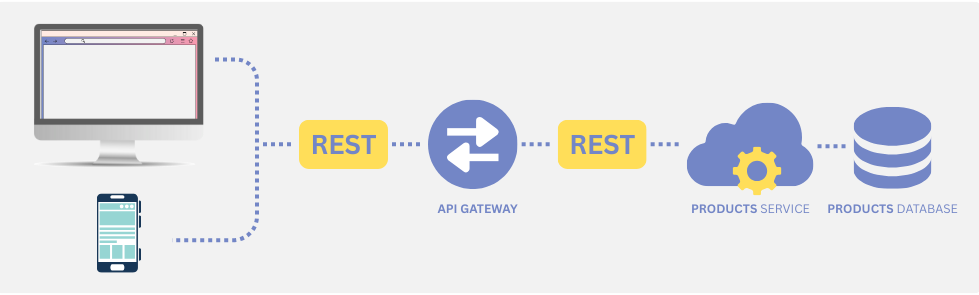

# 🧰 DWES06: Gateway Laravel + Microservicio Spring Boot

En esta tarea desarrollarás una arquitectura basada en **microservicios**, conectando tu aplicación principal en **Laravel** con un **microservicio programado en Java (Spring Boot)**.

Este enfoque te permitirá dividir responsabilidades entre servicios independientes, cada uno potencialmente
desarrollado con diferentes tecnologías.



Laravel actuará como servicio principal y a su vez como API Gateway, redirigiendo ciertas peticiones al servicio Java. De esta manera:

- **Laravel** se encargará de lo siguiente:
  - Gestionará todas las solicitudes recibidas como punto de entrada único.
  - Redireccionará al microservicio si el cliente requiere una funcionalidad que a este le compete.
  - En caso contrario procesará él mismo la solicitud.
- **Microservicio Java (Spring Boot)** → procesará la solicitud que reciba de Laravel según las funcionalidades que se definan en este.
- El estándar de comunicaciones será **JSON**

---

## 📁 Estructura del repositorio

- **[/backend](/backend/)**: Aplicación Laravel como API Gateway.
- **[/microservicio](/microservicio/)**: Microservicio Spring Boot para productos.
- **[moreno_sanchez_sergio_DWES06.sql](moreno_sanchez_sergio_DWES06.sql)**: Script SQL para crear la base de datos.
- **[moreno_sanchez_sergio_DWES06.postman_collection.json](moreno_sanchez_sergio_DWES06.postman_collection.json)**: Archivo Postman para pruebas de la API .

---

## ⚙️ Requisitos previos

>[!NOTE]
> La tarea de evaluación se ha desarrollado bajo las siguientes versiones.

- PHP 8.2.12
- Composer 2.8.6
- Laravel Framework 12.7.2
- Java 21.0.7
- Maven 3.9.9
- MariaDB 10.4.32
- Postman (opcional)

> [!WARNING]
> El microservicio utiliza **Lombok**. Asegúrate de tener el plugin instalado en tu IDE (IntelliJ, Eclipse, VS Code) y que esté habilitado para evitar errores de compilación.

---

## 🧪 Base de datos

Antes de iniciar los servicios, debes crear la base de datos utilizando el script proporcionado en _moreno_sanchez_sergio_DWES06.sql_.

## 🚀 Inicialización de aplicaciones

### 1. Laravel Gateway

```bash
cd backend

# Instalar dependencias
composer install

# Copiar archivo de entorno
cp .env.example .env

# Generar clave de la aplicación
php artisan key:generate

# Configurar conexión a la base de datos en .env

# Iniciar el servidor
php artisan serve
```

>[!NOTE]
> La API Gateway se ejecutará por defecto en `http://localhost:8000`.

### 2. Microservicio Spring Boot

```bash
cd microservicio

# Compilar e iniciar la aplicación
./mvnw spring-boot:run
```

>[!NOTE]
> El microservicio estará disponible en `http://localhost:8080`.

---

## 📬 Archivo Postman

Encontrarás un archivo **.json** para importar en Postman y realizar pruebas con las rutas ya configuradas.

Cómo importar:

1. Abre Postman.
2. Haz clic en **Importar**.
3. Selecciona el archivo **moreno_sanchez_sergio_DWES06.postman_collection.json**.
4. Comienza a probar las rutas del sistema.

---

## 📚 Funcionalidades del microservicio

- CRUD de categorías.
- CRUD de productos.
- Productos bajo stock mínimo.
